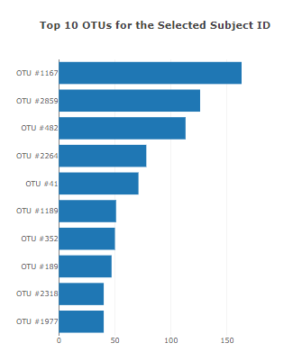
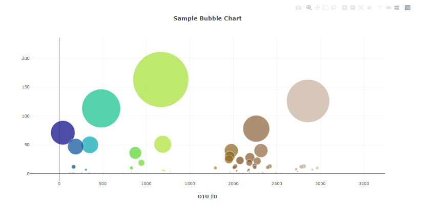
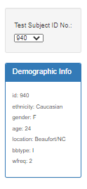
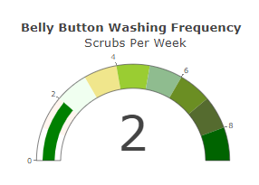
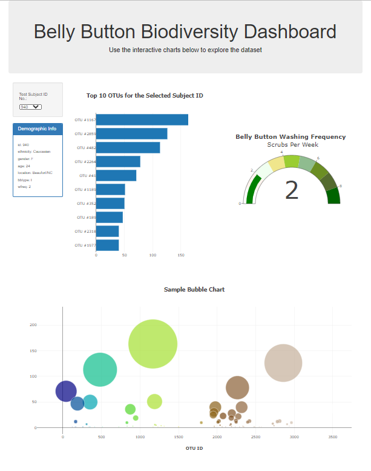

# Plotly-Challenge

This repository contains my solution of the Plotly Challenge Homework  - Belly Button Biodiversity of the GATECH Data Science and Analytics Bootcamp. The goal was to build an interactive dashboard to explore the [Belly Button Biodiversity dataset](http://robdunnlab.com/projects/belly-button-biodiversity/), which catalogs the microbes that colonize human navels and deploy it to GitHub pages: https://nazihzaz.github.io/Plotly-Challenge/

Here are the steps followed:

1. Use the D3 library to read in `samples.json`.

2. Create a horizontal bar chart with a dropdown menu to display the top 10 OTUs found in that individual.

* Use `sample_values` as the values for the bar chart.

* Use `otu_ids` as the labels for the bar chart.

* Use `otu_labels` as the hovertext for the chart.

  

3. Create a bubble chart that displays each sample.

* Use `otu_ids` for the x values.

* Use `sample_values` for the y values.

* Use `sample_values` for the marker size.

* Use `otu_ids` for the marker colors.

* Use `otu_labels` for the text values.

4. Display the sample metadata, i.e., an individual's demographic information.

5. Display each key-value pair from the metadata JSON object somewhere on the page.

6. Update all of the plots any time that a new sample is selected.

7. plot the weekly washing frequency of the individual as a gauge chart.

Below is a screenshot of the final app:

